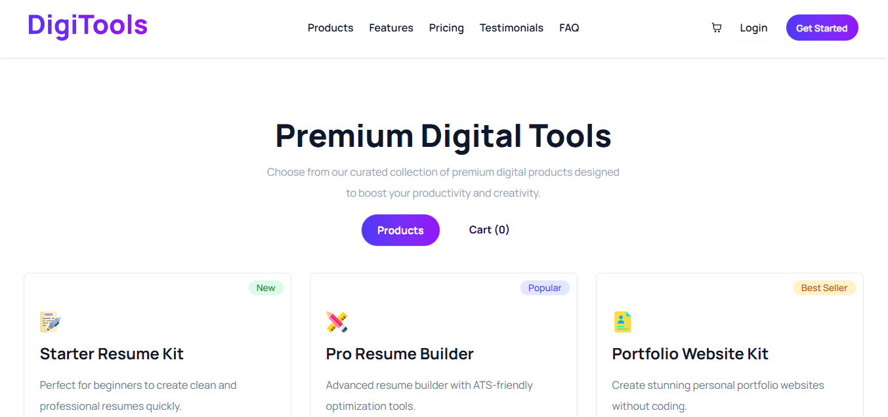

#  DigiTools — Premium Digital Tools Marketplace

> **DigiTools** is a modern, responsive digital product marketplace built with React. Browse premium AI tools, design assets, and productivity software — add them to your cart and checkout seamlessly, all in one beautifully designed platform.

---

## 🌐 Live Demo

🔗 [View Live Site](https://buydigitools.netlify.app/) 

---

## Preview



---

##  Features

-  **Product Catalog** — Browse curated premium digital tools
-  **Shopping Cart** — Add/remove products with live cart count in Navbar
-  **Checkout** — Proceed to payment and clear cart on success
-  **Product Badges** — Visual tags like `New`, `Best Seller`, `Popular`
-  **Stats Counter** — Showcase active users, tools & ratings
-  **Toast Notifications** — Instant feedback on every cart action
-  **Fully Responsive** — Mobile, tablet & desktop optimized

---

## 🛠️ Tech Stack

| Technology | Purpose |
|---|---|
| ⚛️ **React 19** | UI Library |
| 🎨 **Tailwind CSS v4** | Utility-first styling |
| 🌼 **DaisyUI** | UI Component library |
| ⚡ **React `use()` Hook** | Async data fetching (Promise-based) |
| 🔔 **React Toastify** | Toast notifications |
| 🖱️ **React Icons** | Icon library |
| 🖋️ **Manrope** | Typography (Google Fonts) |

---

## 📁 Project Structure

```
src/
├── assets/                            # Images, icons, logos
│
└── components/
    ├── Features/
    │   ├── Carts/
    │   │   ├── Carts.jsx              # Cart view with total & checkout
    │   │   └── CartsCard.jsx          # Individual cart item
    │   │
    │   ├── MyProducts/
    │   │   ├── MyProductBadge.jsx     # Tag badge (New/Best Seller/etc)
    │   │   ├── MyProductCard.jsx      # Individual product card
    │   │   ├── MyProductFeatureListItem.jsx
    │   │   └── MyProducts.jsx         # Product grid
    │   │
    │   └── Features.jsx               # Products/Cart toggle section
    │
    ├── Homepage/
    │   ├── Banner.jsx                 # Hero section
    │   ├── Counter.jsx                # Stats (Users, Tools, Rating)
    │   ├── Footer.jsx                 # Footer with links & social
    │   ├── GetStarted.jsx             # 3-step onboarding section
    │   ├── Pricing.jsx                # Pricing section
    │   └── WorkFlow.jsx               # CTA section
    │
    ├── Navbar/
    │   └── Navbar.jsx                 # Sticky navbar with cart count
    │
    └── ui/
        ├── GetStartedCard.jsx         # Onboarding step card
        └── PricingCard.jsx            # Pricing plan card

App.css                                # Tailwind + Google Fonts
App.jsx                                # Root component & state management
main.jsx                               # App entry point

public/
├── products.json                      # Product data
└── pricing.json                       # Pricing plan data
```

---

##  Getting Started

### Prerequisites

- [Node.js](https://nodejs.org/) v18+
- npm or yarn

### Installation

**1. Clone the repository**
```bash
git clone https://github.com/IamPial/digitools-pricing-app.git
cd digitools-pricing-app
```

**2. Install dependencies**
```bash
npm install
```

**3. Start the development server**
```bash
npm run dev
```

**4. Open in browser**
```
http://localhost:5173
```

---

## 📦 Build for Production

```bash
npm run build
```

---

## 🗃️ State Management

State is managed in `App.jsx` and passed down via props:

| State | Type | Description |
|---|---|---|
| `count` | `number` | Total items in cart (shown in Navbar) |
| `buyItem` | `array` | List of products added to cart |
| `amount` | `number` | Total price of cart items |
| `toggleBtn` | `string` | Switch between Products / Cart view |

### Cart Logic

- **Add to cart** → `handleBuyItem()` in `MyProductCard` — prevents duplicate entries
- **Remove from cart** → `handleDelete()` in `Carts` — updates count & total
- **Checkout** → `handlePayment()` — clears cart and resets all state

---

## 📄 Data Structure

### `products.json`
```json
[
  {
    "id": 1,
    "name": "Starter Resume Kit",
    "description": "Perfect for beginners to create clean and professional resumes quickly.",
    "price": 0,
    "period": "one-time",
    "tagType": "new",
    "features": ["10+ templates", "Basic customization", "Download as PDF"],
    "icon": "https://i.ibb.co.com/p66rxDtM/writing-2327400-1.png"
  },
  {
    "id": 2,
    "name": "Pro Resume Builder",
    "description": "Advanced resume builder with ATS-friendly optimization tools.",
    "price": 15,
    "period": "monthly",
    "tagType": "popular",
    "features": ["100+ templates", "ATS optimization", "Export to PDF", "Custom sections"],
    "icon": "https://i.ibb.co.com/gLF6c8M9/design-tool.png"
  }
  // ...and 6 more products
]
```

### `pricing.json`
```json
[
  {
    "id": 1,
    "plan": "Starter",
    "tagline": "Perfect for getting started",
    "price": 0,
    "period": "monthly",
    "isPopular": false,
    "tag": "New",
    "features": ["Access to 10 free tools", "Basic templates", "..."],
    "label": "Get Started Free"
  }
  // ...and 2 more plans (Pro, Enterprise)
]
```

---

## 🤝 Contributing

1. Fork the repository
2. Create a branch: 
3. Commit: 
4. Push: 
5. Open a Pull Request

---

## 📄 License

This project is licensed under the [MIT License](./LICENSE).

---

## Author

**Pial Uddin**
- GitHub: [IamPial](https://github.com/IamPial)
- LinkedIn: [linkedin](https://linkedin.com/in/pial-uddin)


